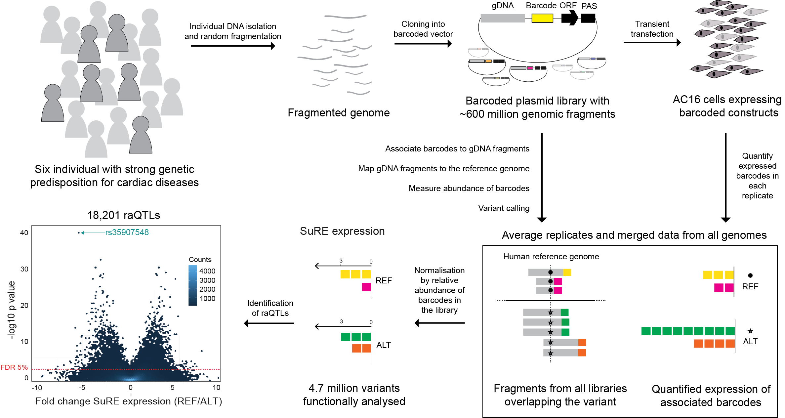
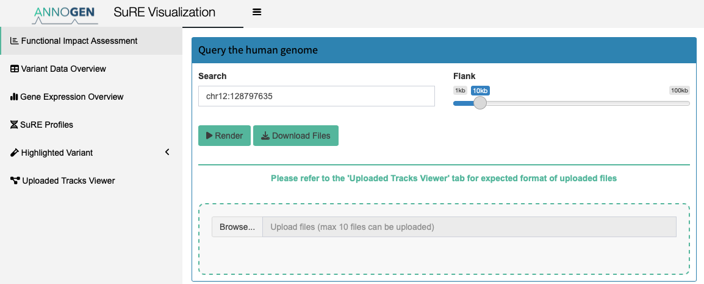
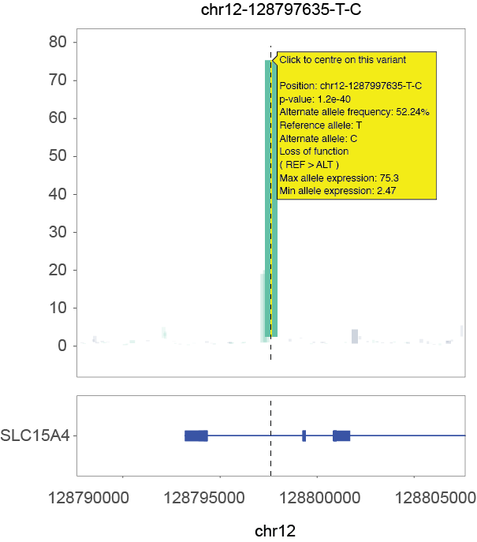
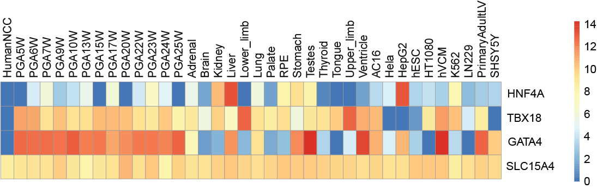
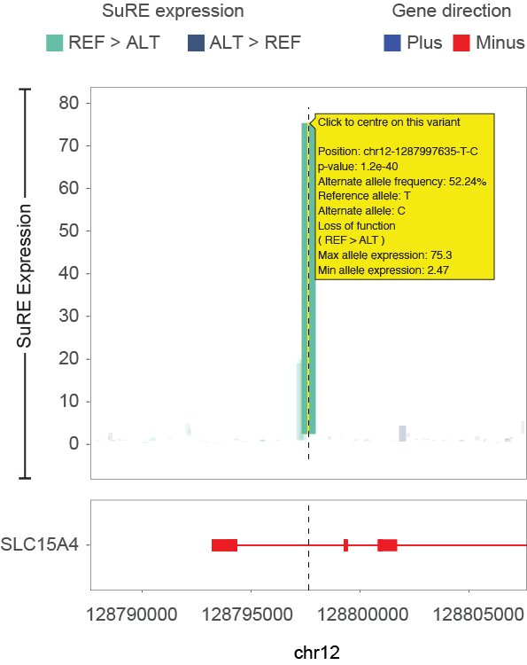

SuREViz: A Web-Based SuRE MPRA Data Exploration Tool to Visualize the
Impact of Nucleotide Variants
================
Vartika Bisht
2024-12-03

# Introduction

Welcome to **SuREViz**, your go-to tool for exploring the functional
impacts of genetic variants. This user manual will guide you through the
platform’s features, functionalities, and capabilities.

<strong>Key Features:</strong>

- Interactive visualization of over 4.7 million variants.  
- Integration of functional, genomic, and clinical datasets.  
- Tools for uploading and comparing your own data.  

------------------------------------------------------------------------

# Getting Started

To access **SuRE Viz**, you’ll need:

- A modern web browser: Google Chrome, Mozilla Firefox, or Safari.
- A stable internet connection.

 

You can access the SuRE Viz app at:
[SuREViz](https://www.surevizapp.com)

------------------------------------------------------------------------

# App Features and Layout

## Query Box

### Search Functionality

- **Variants:** Enter the chr:pos format (e.g., chr1:128797635).
  - The variant must be functionally assessed by SuRE MPRA. If the
    variant is not available, the app will display an error message.
- **Genes:** Enter the gene name (case-insensitive, e.g., TBP or tbP).
  - Gene names should follow the specifications of the **GENCODE GTF
    GRCh38.p14 Human Release 46**.

------------------------------------------------------------------------

### Customizing Search

Adjust the **Flanking Region Slider** to explore regions ranging from
**1 kb to 100 kb** around your query. This allows for a flexible search
area.

------------------------------------------------------------------------

### Upload Functionality

Use the **Browse** button to upload your own custom MPRA data, BigWig,
and BED files. These files will be visualized in the **Uploaded Track
Viewer** tab.

------------------------------------------------------------------------

### Download Functionality

Once your search results are rendered, you have the option to download
the visualized data as a zipped file. The zip file contains the
following:

1.  **JASPAR2022_info.csv**  
    This file contains information about **Transcription Factors (TFs)**
    that are affected by the variant you are querying. This is only
    available when downloading **variant view data**. If you’re
    downloading **gene view data**, this file will not be included. The
    contents of the file are similar to what you see in the
    **Transcription Factor Binding Site Impact (TFBSi)** sub-tab within
    the highlighted variant tab, but with additional data. The columns
    include:

    - **CHROM, POS, REF, ALT**  
      These columns define the chromosome, position, reference allele,
      and alternate allele of the variant.

    - **motif_alt_id, motif_id**  
      The motif name and ID of the TF as specified in the **JASPAR
      2022** database.

    - **start, end, strand, pos**  
      The start and end positions of where the TF aligns to the human
      sequence, along with the strand and position.

    - **refs.score, alts.score, refs.pval, alts.pval**  
      The **TFBSi scores** and **p-values** as calculated by the
      algorithm. The scores indicate the affinity of the TF to the
      reference and alternate sequences, and the p-values reflect the
      significance of this binding — how significantly well the TF binds
      to the predicted binding site compared to a random sequence.

    - **absdiff, max.score, effect.JASPAR**

      - **absdiff**: The absolute difference between the reference and
        alternate scores.
      - **max.score**: The higher of the reference or alternate score.
      - **effect.JASPAR**: Quantifies the change in binding using the
        formula: -log10(p-value of ref / p-value of alt), indicating the
        effect of the variant on TF binding.

    - **tax_group, tf_family, tf_class, pubmed_ids, uniprot_ids,
      data_type, Gene_Name**  
      Additional information about the TF:

      - **tax_group**: The taxonomic group of the TF.
      - **tf_family**: The family of the TF.
      - **tf_class**: The class of the TF.
      - **pubmed_ids**: PubMed IDs of relevant papers where the TF is
        mentioned.
      - **uniprot_ids**: UniProt ID of the gene linked to the TF.
      - **data_type**: The experimental data type used to define this
        TF, e.g., **HT-SELEX**.
      - **Gene_Name**: The gene name associated with the TF (since we
        consider only TFs expressed in the cell type used for the MPRA
        assay).

2.  **SNP_info.csv**  
    A CSV file containing tabular data as presented in the **Variant
    Data Overview** tab. This includes detailed information about the
    SNPs, such as their chromosomal positions and related information.

3.  **SuREX\_.bedGraph**  
    A **BEDGraph** file containing the **SuRE profile** for the locus
    you queried. This file is specifically generated for the variant
    locus and provides the SuRE data relevant to that region.

<strong>Search Functionality:</strong> This screenshot highlights the
search bar, query options for variants and genes, the flanking region
slider for customizing your search, and the upload functionality for
custom data. Use the <strong>Browse</strong> button to upload your own
MPRA, BigWig, or BED files and visualize them in the <strong>Uploaded
Track Viewer</strong> tab.

------------------------------------------------------------------------

 

## Visualization Modes

### Variant View

- Focused analysis of **specific variants** or when you put query of
  format chr:pos in the search bar.
- Displays allele expression levels with interactive elements.

------------------------------------------------------------------------

### Region View

- Gene-centric exploration of surrounding genomic features or when you
  write the name of the gene you want to look for in the query bar.

<strong>Visualization Modes:</strong> This screenshot highlights the two
visualisation modes possible where in one you can target a variant of
intrest that has been functionally assessed by us in our SuRE assay and
the gene of intrest.

------------------------------------------------------------------------

## Tabs Overview

### Functional Impact Assessment

- **SuRE Impact Plot:**  
  Displays the expression levels of reference and alternate alleles.
  - **Height:** Represents expression levels.  
  - **Width/Opacity:** Indicates statistical significance of
    differences.  
- **Gene Plot:**  
  Highlights genes in the query region, with interactive tools for
  exploration.

<strong>Functional Impact Assessment Tab:</strong> This screenshot
highlights the SuRE impact and gene plot in the functional impact
assessment tab for variant chr12-128797635-T-C.

------------------------------------------------------------------------

 

### Variant Data Overview

Provides a detailed table of all variants in the query region:

| **Column** | **Description** |
|----|----|
| **Chromosome** | Indicates the chromosome where the variant is located. |
| **Position (hg38)** | Specifies the genomic position of the variant according to the human hg38 reference genome. |
| **Reference Allele** | Indicates the reference allele at the variant’s position. |
| **Alternate Allele** | Indicates the alternate allele observed at the variant’s position. |
| **rsID** | The rsID, if available in dbSNP150, assigned to the variant. |
| **Population Allele Frequency** | Provides the allele frequency of the variant in the gnomAD 3.1.2 database across various populations. |
| **SuRE Impact Score** | SuRE MPRA impact score indicating the variant’s effect on transcription. |
| **Genotype in SuREXX** | Indicates the genotype of the variant in each SuREXX sample (e.g., SuRE38, SuRE57, etc.). |
| **Alternate Allele Coverage** | Specifies the coverage (number of fragments) for the alternate allele. |
| **Reference Allele Coverage** | Specifies the coverage (number of fragments) for the reference allele. |
| **Reference Allele Mean Expression** | Indicates the mean expression level of the reference allele across samples. |
| **Alternate Allele Mean Expression** | Indicates the mean expression level of the alternate allele across samples. |
| **p-value** | Indicates the p-value calculated based on the Wilcoxon rank sum test between the reference and alternate alleles for each variant. |
| **Description** | Indicates if the variant is an raQTL or not. |

------------------------------------------------------------------------

 

### Gene Expression Overview

In this tab, we visualize gene expression of genes within the window
shown in the **Functional Impact Assessment** tab. The data shown below
is a collection of transcriptomic data from various sources, such as
ENCODE, GEO, and ArrayExpress. The data encompasses gene expression in
the following contexts:

- **Fetal human heart at developmental stages**
- **Fetal tissues during development**
- **Healthy (non-failing) adult human heart**
- **In-vitro differentiated cardiomyocytes** and undifferentiated human
  embryonic stem cells (H1)
- **AC16 cell line** where SuRE constructs are transfected
- **Human neural crest cells** (migrating from the neural tube and
  entering the heart from pharyngeal arches)

We specifically highlight gene expression for TBX18 and GATA4, which are
known cardiac stem cell marker genes expressed highly during
development, as well as HNF4A, a liver-specific gene, to show contrast
in tissue-specific expression.

<strong>Gene Expression Overview Tab:</strong> This screenshot
highlights the expression of genes within the locus of interest as shown
in <strong>Functional Impact Assessment Tab</strong>.

------------------------------------------------------------------------

 

### SuRE Profile

This section looks into the functional profiles of patients analyzed in
this study, complemented by insights from the AC16 ATAC-seq dataset and
conservation scores across multiple species. Together, these datasets
provide a comprehensive understanding of regulatory mechanisms and
evolutionary conservation within the loci of interest.

1.  **SuRE Profiles of Patients:**  
    The analysis begins with SuRE profiles derived from congenital heart
    disease patients, as discussed in the cited referenced paper. These
    profiles offer valuable insights into the functional behavior of
    genomic regions within individuals.

2.  **AC16 ATAC-seq Data:**  
    Since SuRE libraries are introduced into the AC16 Human
    Cardiomyocyte Cell Line, we incorporate AC16 ATAC-seq data. This
    dataset highlights regions of open chromatin within the endogenous
    AC16 genome, providing context for chromatin accessibility and
    regulatory potential.

3.  **PhasCon Score:**  
    These scores represent conservation scores across 30 mammalian
    species. This dataset highlights evolutionary conservation patterns
    within the locus of interest, offering insights into its functional
    and evolutionary significance.

 

<strong>SuRE Profile Tab:</strong> This screenshot highlights the SuRE
expression profile of patients (subset) centered around variant
chr12-128797635-T-C. The dotted line indicating the location of selected
variant.

------------------------------------------------------------------------

 

### Highlighted Variants

The **Highlighted Variants** section displays selected variant’s
potential impact on gene regulation, transcription factor binding, and
disease association.

#### Transcription Factor Binding Site Impact (TFBSi)

When exploring a variant, this feature evaluates disruptions in
transcription factor (TF) interactions due to sequence changes only for
raQTLs (please refer to the cited manuscript for defination of raQTL).
Key details include:

- **Predicted Alignment:**  
  Alignment of the TF with both reference (REF) and alternate (ALT)
  sequences, offering insights into binding behavior.

- **Predicted Affinity Change:**  
  Metrics showing how TF affinity is altered from REF to ALT, indicating
  whether binding strength is enhanced or diminished.

<strong>Transcription Factor Binding Site Impact (TFBSi) Tab:</strong>
This screenshot highlights the alignment of the TFBS affected by
chr12-128797635-T-C to the reference and alternate sequence as shown in
the TFBSi tab.

------------------------------------------------------------------------

 

#### ClinVar Database

The **ClinVar** tab provides access to disease-related annotations for
selected variants, including classifications such as *Pathogenic* or
*Benign* and detailed reports on variant-disease associations, including
drug response. Additional information can be found at
[ClinVar](https://www.ncbi.nlm.nih.gov/clinvar/).

------------------------------------------------------------------------

 

#### Genome Aggregation Database (gnomAD)

The **gnomAD** tab offers population-level data on allele frequencies
across diverse populations, along with tools for functional impact
evaluation, including VEP, CADD scores, and phyloP conservation metrics.
Explore more at [gnomAD](https://gnomad.broadinstitute.org/).

------------------------------------------------------------------------

 

### Uploading Your Data

SuREViz provides robust support for users to upload and visualize their
own data alongside the existing SuRE MPRA results. Whether you’re
working with MPRA-specific data, genomic annotations, or coverage
tracks, SuREViz allows you to integrate and analyze your custom
datasets.

1.  **MPRA Data**: MPRA data files (TSV/CSV format) must include columns
    like chromosome (prefixed with “chr\_”), position,
    reference/alternate alleles, expression signals, and p-values to
    enable visualization of variant effects on transcription through
    markers on plots.

2.  **BigWig Files**: BigWig files, used for genomic coverage data, are
    processed with R’s `rtracklayer` package, ensuring file integrity
    through partial reads and error detection for invalid files.

3.  **BED Files**: BED files annotate genomic regions of interest and
    should contain at least three columns (chromosome, start position,
    and end position) to integrate with the visualization tracks.

#### Tips for Uploading

- **File Size Optimization**  
  If your file exceeds **30MB**, consider subsetting it:
  - Use tools like `bcftools` or `bedtools` for chromosome-specific
    extractions.  
  - For BigWig files, convert to BedGraph, filter, and convert back
    using `bigWigToBedGraph`.
- **Avoid Overloading Visualizations**  
  Limit uploads to **10 files** at a time to maintain clarity and
  responsiveness.  

------------------------------------------------------------------------

 

# Contact and Feedback

For any questions or feedback, please contact us at
**<vartikabisht6197@gmail.com>** or visit our
[website](https://annogen.bio).
