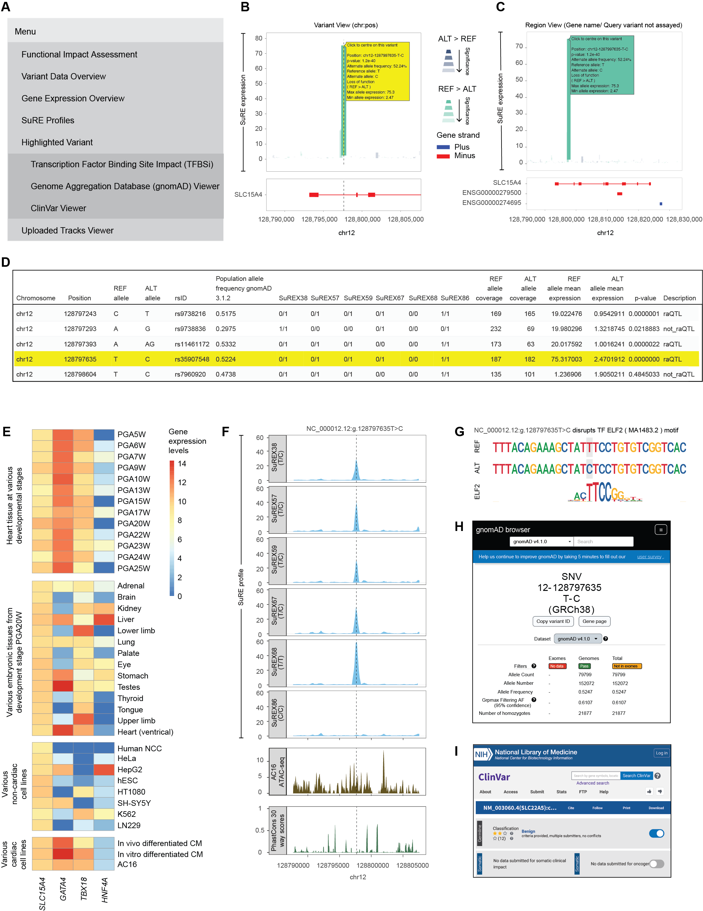

# SuREViz: A Web-Based SuRE MPRA Data Exploration Tool

An R shiny platform designed for exploring the functional impact of genetic variants assessed by the SuRE (Survey of Regulatory Elements) massively parallel reporter assay. SuREViz empowers researchers and data enthusiasts with interactive tools to visualize the interplay between genomic variants and gene regulation to predict genetic consequences variants.

---

  

*Figure 1. Overview of the SuREViz platform and its functionality. A) Variant View in the “Functional Impact Assessment” Tab: Displays SuRE impact plot and the gene plot data for the region of interest. The yellow line and hover highlight indicate the specific variant queried by the user, confirming that it was assayed in SuRE. B) Region View in the “Functional Impact Assessment” tab: Displays SuRE impact plot and the gene plot data for the region of interest when a gene is queried, or when the queried variant was not assayed by SuRE. C) Menu Bar: Interface on the left side of the application for navigating through SuREViz features. D) Search Bar: Interface positioned on the right side of the menu bar, featuring a search box for input queries, a slider to adjust the flank from 1kb to 100kb (default set at 10kb), and three buttons for browse, download, and render. E)  “Variant Data Overview” tab: A detailed table of variants, including the queried variant, with data linked to the “Functional Impact Assessment” tab. F) “Gene Expression Overview” tab: Shows the expression profiles of relevant genes, including marker genes GAAT5 and TBX18 for cardiac stem cells, and HNF4A, a control gene highly expressed in liver tissue, across 38 tissue types. G) “Transcription Factor Binding Site Impact (TFBSi)” sub-tab in the “Highlighted Variant” tab: Shows binding motifs of transcription factors affected by the queried variant. H) “Genome Aggregation Database (gnomAD) Viewer” sub-tab in the “Highlighted Variant” Tab: Provides query results from the gnomAD database, including information about the queried variant if available. I) “ClinVar Viewer” sub-tab in the “Highlighted Variant” Tab: Displays ClinVar database results for the queried variant, if it is listed, to provide clinical significance and annotations. J) “SuRE Profile” Tab: Displays SuRE expression data for loci defined in the “Functional Impact Assessment” tab. The dotted line indicates the queried variant (if assayed by SuRE), alongside additional data like AC16 ATAC-seq profiles and PhastCons conservation scores across 30 mammalian species.*

---

## 🌟 Key Features

✨ **Interactive Visualization**: Explore over 4.7 million variants categorized into raQTLs and non-raQTLs.  
✨ **Genomic Data Integration**: Combines functional, genomic, and clinical datasets for enriched insights.  
✨ **Custom Data Upload**: Easily compare user-provided MPRA data, BigWig, and BED files.  
✨ **Flexible Querying**: Search by variants (`chr:pos`) or gene name. 
✨ **Downloadable Results**: Export your analyzed data in user-friendly formats.  

---

## 🔬 Data Sources

- **Processed Data**: Available on OSF at [pyh83](https://osf.io/pyh83/).  
- **Raw Data**: Accessible through GEO at ...  

---

## 🔬 What is SuRE?

SuRE (Survey of Regulatory Elements) is a high-throughput assay used to study gene regulation. It maps allele-specific expression back to the genome, allowing researchers to assess changes in regulatory activity upon the introduction of SNPs and InDels. The current SuREViz application showcases data from heart-related studies, including six complex plasmid libraries representing 4.7 million variants.  

### 🧬 What are raQTLs?  
**Reporter Assay Quantitative Trait Loci (raQTLs)** are variants showing significant differences in expression between reference and alternate alleles, highlighting the regulatory impact of variants.

---

## 🚀 Getting Started

To begin your journey with SuREViz:  
1. Access the platform here: **[SuREViz](http://192.168.107.99:6197)**  
2. Liftover your queries to hg38 genome assembly before using the application. 

---

## 🎓 Tutorial

Get started quickly with our detailed step-by-step tutorial:  
👉 **[SuREViz Tutorial](https://vartikabisht6197.github.io/SuREViz/SuREVizTutorial.html)** 👈  

---

## 🤝 Contributing and Support  

We ❤️ contributions!  
- Found a bug? Open an **issue**.  
- Questions? Contact **reachout.vartika@gmail.com** for direct support.

---

### 🌟 Thank You for Exploring SuREViz!  
Together, let’s uncover the regulatory mechanisms behind genetic variants. 🌍✨
